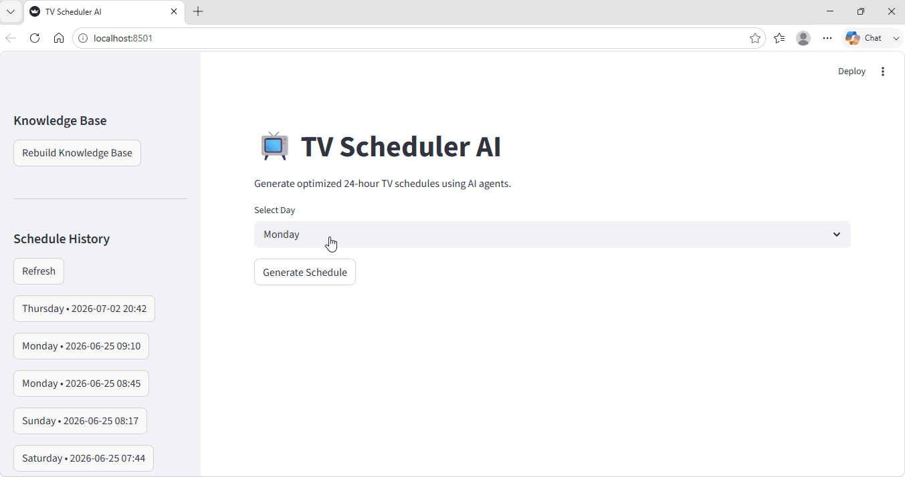

# Multiagent TV Scheduler

An AI-powered TV scheduling system that uses a pipeline of specialized agents to generate optimized 24-hour broadcast schedules. Each agent analyzes audience data, live sports events, scheduling best practices, and retention patterns — then hands its output to the next agent in the chain.

---

## How It Works



## Architecture

```
Streamlit UI
    │
    ▼
FastAPI Backend
    │
    ▼
SchedulerWorkflow
    ├── AudienceAgent  ─┐  (run in parallel)
    └── ContentAgent   ─┘
            │
            ▼
    SchedulingAgent   (builds 24-hour schedule)
            │
            ▼
    OptimizationAgent (refines for retention)
            │
            ▼
    PostgreSQL        (schedule saved)
            │
            ▼
    Job polling → Streamlit (live progress)
```

### Agents

| Agent | Role |
|-------|------|
| **AudienceAgent** | Queries the RAG knowledge base for audience ratings and predicts best viewing times and preferred content for the requested day |
| **ContentAgent** | Fetches live sports events from TheSportsDB API; falls back to TVMaze sports broadcast schedule; falls back to `data/programs.csv` if both APIs are unavailable |
| **SchedulingAgent** | Combines audience insights + program list with scheduling best practices to build a full 24-hour schedule (00:00–24:00) across 7 named day-parts |
| **OptimizationAgent** | Reviews the draft schedule against audience retention guidelines and returns the final optimized version |

### Day-Part Structure

The 24-hour schedule is divided into 7 programming blocks:

| Time | Block | Content |
|------|-------|---------|
| 00:00–06:00 | Overnight | Archive sports, classic match replays |
| 06:00–09:00 | Breakfast | Morning news, sports headlines |
| 09:00–12:00 | Mid-Morning | Documentaries, sports science, magazines |
| 12:00–15:00 | Afternoon | Sports highlights, entertainment |
| 15:00–18:00 | Late Afternoon | Live sports (if available) |
| 18:00–23:00 | Prime Time | Live sport, premium analysis |
| 23:00–00:00 | Late Evening | News wrap, post-match analysis |

### RAG (Retrieval-Augmented Generation)

The agents retrieve relevant knowledge at runtime from a local FAISS vector database built from text files in `data/`:

- `programming_best_practices.txt` — editorial rules for all day-parts
- `scheduling_guidelines.txt` — 24-hour day-part rules and priorities
- `ratings_history.txt` — historical viewer numbers by time of day and genre

Embeddings are generated with `sentence-transformers/all-MiniLM-L6-v2` (runs locally, no API needed).

---

## Tech Stack

| Layer | Technology |
|-------|-----------|
| LLM | Claude claude-sonnet-4-6 via LangChain Anthropic |
| Vector DB | FAISS (local file) |
| Embeddings | HuggingFace sentence-transformers |
| Backend API | FastAPI + Uvicorn |
| Database | PostgreSQL via SQLAlchemy |
| Frontend | Streamlit |
| Live sports data | TheSportsDB API + TVMaze API (both free, no auth) |
| Agent orchestration | Custom Python workflow with `ThreadPoolExecutor` |

---

## Prerequisites

- Python 3.11+
- PostgreSQL 14+ running locally
- An Anthropic API key

---

## Installation

### 1. Clone and install dependencies

```bash
pip install -r requirements.txt
```

### 2. Configure environment

Copy `.env.example` to `.env` and fill in your values:

```bash
cp .env.example .env
```

```env
ANTHROPIC_API_KEY=sk-ant-...        # Your Anthropic API key
DB_HOST=localhost
DB_PORT=5432
DB_NAME=tv_scheduler
DB_USER=postgres
DB_PASSWORD=your_postgres_password
FAISS_INDEX_PATH=vectorstore/faiss_index
TV_COUNTRY=GB                       # TVMaze country for sports fallback (GB, US, AU, etc.)
```

### 3. Create the PostgreSQL database

```bash
# Using psql
psql -U postgres -c "CREATE DATABASE tv_scheduler;"

# Or using pgAdmin: create a database named "tv_scheduler"
```

### 4. Build the RAG vectorstore

Run once before first use (or use the in-app button — see Usage):

```bash
python -m backend.rag.ingest
```

---

## Running the App

Open two terminals in the project root:

**Terminal 1 — Backend:**
```bash
uvicorn backend.main:app --reload --port 8000
```

**Terminal 2 — Frontend:**
```bash
streamlit run Frontend/streamlit_app.py
```

Open your browser to `http://localhost:8501`.

---

## Usage

1. Select a day from the dropdown
2. Click **Generate Schedule**
3. Watch the agent progress panel update in real time as each agent completes
4. The final 24-hour schedule appears as a table (00:00 to 24:00)
5. Past schedules are saved automatically and appear in the **Schedule History** sidebar — click any entry to reload it
6. After editing any file in `data/`, click **Rebuild Knowledge Base** in the sidebar to refresh the RAG vectorstore without restarting the server

---

## API Reference

Interactive docs at `http://localhost:8000/docs`.

| Method | Path | Description |
|--------|------|-------------|
| `POST` | `/generate-schedule` | Start a schedule generation job. Returns `{job_id}` immediately. Body: `{"day": "Friday"}` |
| `GET` | `/job/{job_id}` | Poll job status. Returns `{status, messages, result}` |
| `POST` | `/ingest` | Rebuild the RAG vectorstore from `data/*.txt` files. Returns `{job_id}` to poll via `/job/{id}` |
| `GET` | `/schedules` | List the 20 most recent saved schedules |
| `GET` | `/schedules/{id}` | Retrieve a specific schedule by ID |

---

## Project Structure

```
.
├── .env                          # Local config (never commit this)
├── .env.example                  # Config template
├── .gitignore
├── requirements.txt
│
├── backend/
│   ├── main.py                   # FastAPI app, job management, all endpoints
│   ├── workflow.py               # SchedulerWorkflow — orchestrates agents
│   ├── schemas.py                # Pydantic models
│   ├── database.py               # SQLAlchemy engine + session factory
│   ├── models.py                 # Schedule ORM model
│   │
│   ├── agents/
│   │   ├── audience_agent.py     # Audience analysis via RAG + LLM
│   │   ├── content_agent.py      # Live API fetcher with CSV fallback
│   │   ├── scheduling_agent.py   # 24-hour schedule builder
│   │   └── optimization_agent.py # Schedule optimizer
│   │
│   ├── rag/
│   │   ├── ingest.py             # Indexing script (CLI or via /ingest API)
│   │   ├── vectorstore.py        # FAISS setup + HuggingFace embeddings
│   │   └── retriever.py          # KnowledgeRetriever class
│   │
│   ├── services/
│   │   ├── llm_service.py        # Shared ChatAnthropic instance
│   │   ├── json_parser.py        # Strips markdown fences, parses LLM JSON output
│   │   └── sports_api.py         # TheSportsDB + TVMaze live data fetchers
│   │
│   └── prompts/
│       └── schedule_prompt.py    # SCHEDULE_FORMAT — the JSON output template
│
├── Frontend/
│   └── streamlit_app.py          # UI: job polling, progress, history sidebar, ingest button
│
├── data/
│   ├── programs.csv              # Fallback program inventory (title, category, duration)
│   ├── programming_best_practices.txt
│   ├── scheduling_guidelines.txt
│   └── ratings_history.txt
│
└── vectorstore/                  # Auto-generated by ingest (gitignored)
    ├── index.faiss
    └── index.pkl
```

---

## Customization

### Adding fallback programs

Edit `data/programs.csv` — these are used when both live APIs return no results:

```csv
title,category,duration
My New Show,Entertainment,60
```

### Live sports data

`ContentAgent` queries in this order:
1. **TheSportsDB** (`/eventsday.php`, free public key, Soccer events for the target date)
2. **TVMaze** (sports genre filter, country set by `TV_COUNTRY` in `.env`)
3. **CSV fallback** (`data/programs.csv`) if both APIs return nothing

Change the country for TVMaze by setting `TV_COUNTRY=US` (or `AU`, `DE`, etc.) in `.env`.

### Expanding the knowledge base

Add any `.txt` file to `data/` then either:
- Click **Rebuild Knowledge Base** in the Streamlit sidebar, or
- Run `python -m backend.rag.ingest` from the terminal

### Changing the LLM

Edit `backend/services/llm_service.py` — all agents share this single instance.
